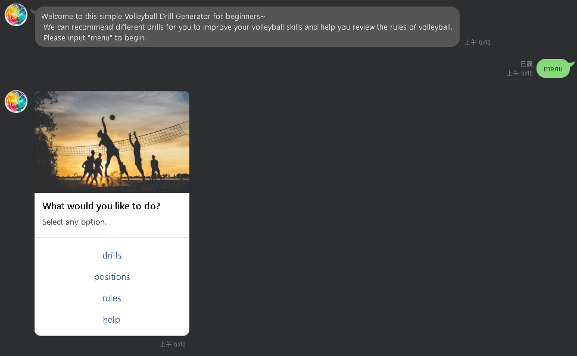
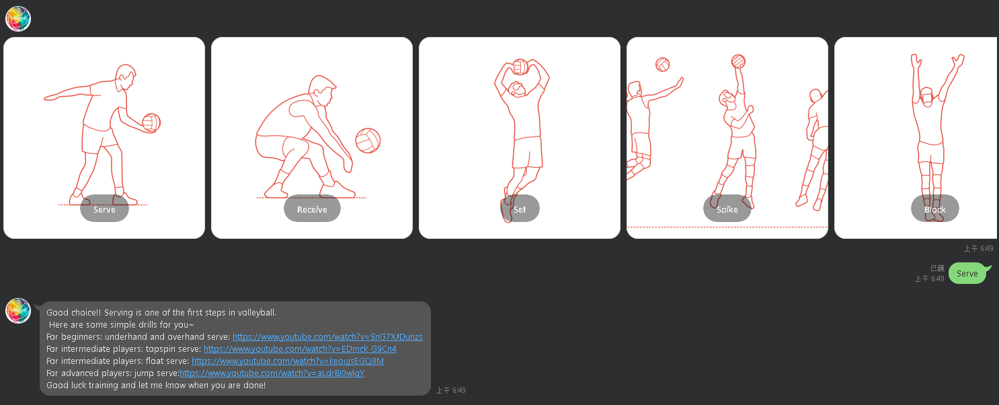
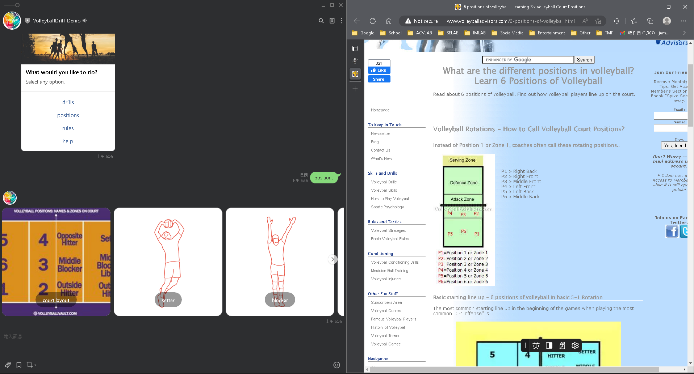
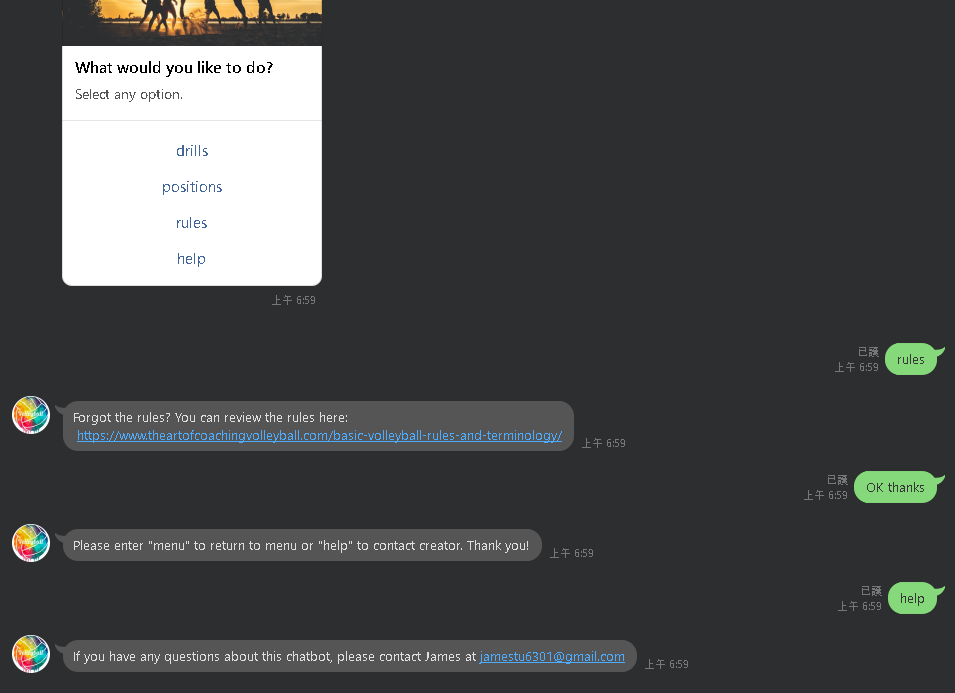
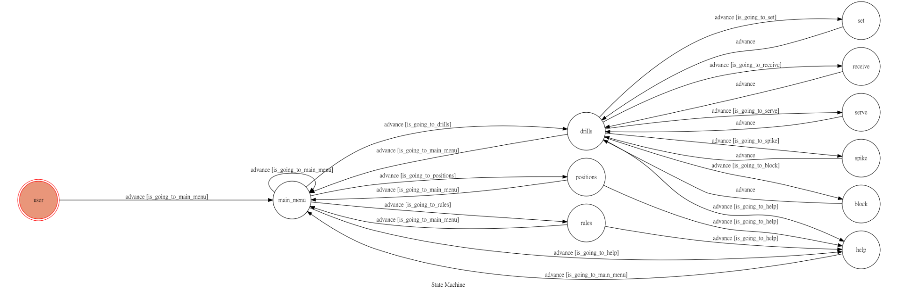

# TOC Project 2022: Volleyball Practice Helper for Beginners

> Code for TOC Linebot Project 2022
> By James Tu/杜霙笙 /H24086032

A Line bot based on a finite state machine. 

## Project Description: 
### Project Summary 
As the creator of this chatbot, I am proud to offer a tool that helps beginners understand the rules and positions of volleyball. As someone who is deeply passionate about the sport, I understand the importance of learning the basics and improving your skills. That's why our chatbot is designed to provide a clear and concise overview of the rules and positions, as well as recommend videos for practicing. Whether you're new to the sport or just need a refresher, our chatbot is here to help. I hope that by using our chatbot, more people will be able to discover and enjoy the wonderful world of volleyball.

### Basic Information
+ Project Name: Volleyball Practice Chatbot

+ Line ID: @292xgzrc
+ QRCode: ![fsm]   (./img/qrcode.png)

### Pictures for Demonstration: 
The following are the main functions and services provided by the chatbot.
+ A start menu for you to choose what service you need. 

+ A drills menu under the drills service that recommends videos for you to watch and practice accordingly. The topics covered include serving, receiving, setting, spiking, and blocking.  

+ A list of recommended websites to browse to get to know more about the positions in volleyball. Overall layout depicts the positions on the court, and the rest describe each position based on the role in detail. The positions include, setter, hitter, middle-blocker, and libero. 

+ A recommended website for you to confirm your knowledge about the ruled of volleyball and help feature that (temporarily) allows you to know the contact information of the creator so that necessary fixes or improvements can be made to the chatbot. 

## Finite State Machine

### State Description:
+ user: used to display welcome message.
+ main menu: the initial state that allows the user to choose what services he/she requires.
+ drills: the drills menu for the user to choose what he/she wants to practice. 
+ serve, receive, set, spike, block: states that give the user their respective tutorials. 
+ positions: state that includes links and figures of the information on the positions in volleyball. 
+ rules: state that provides resources for the rules of volleyball. 
+ help: state that includes the creator's contact information. 

